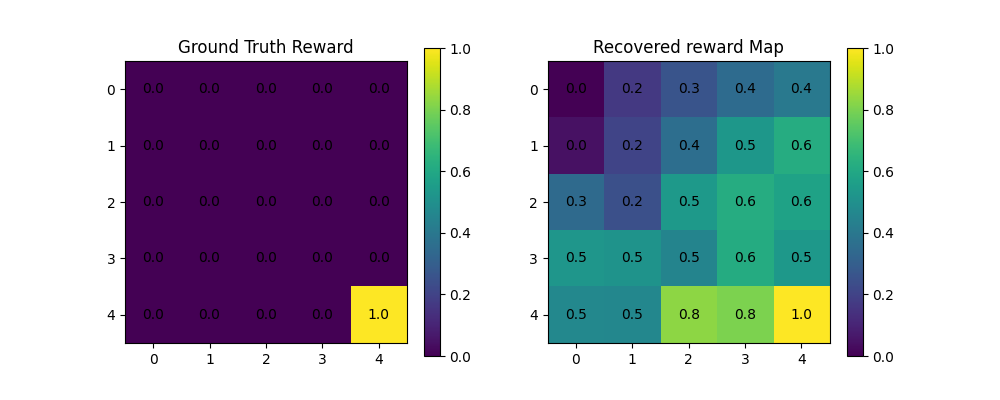
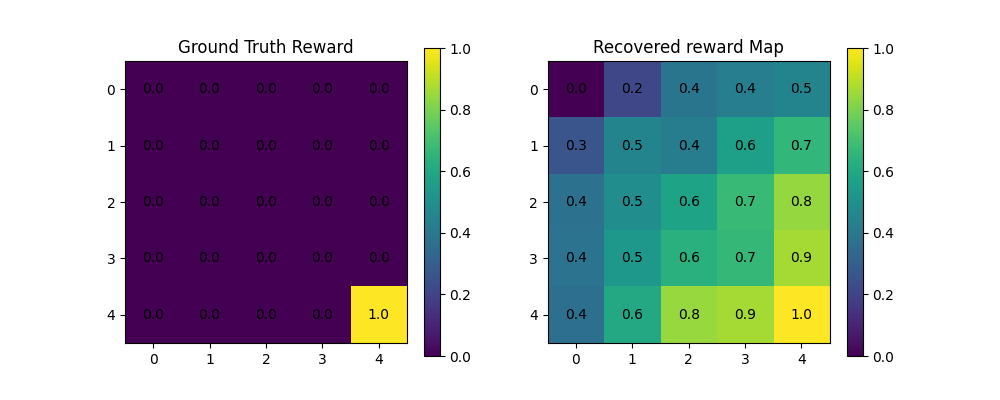
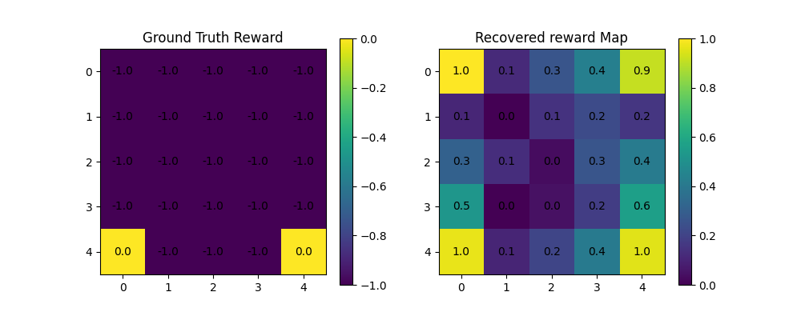
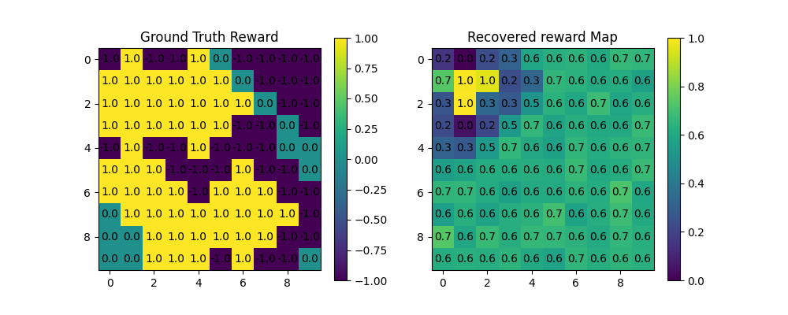
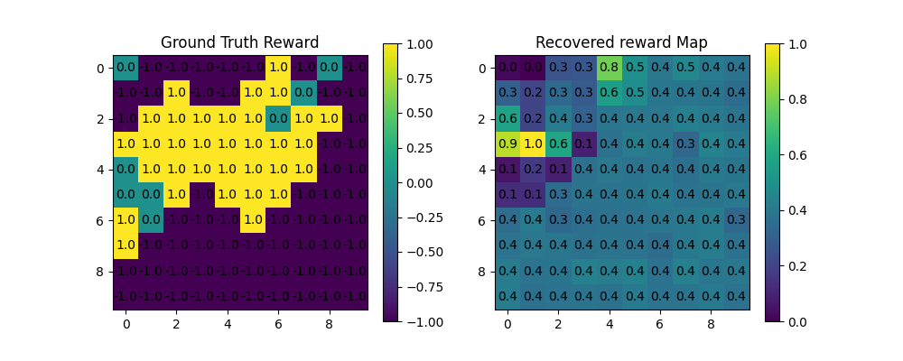
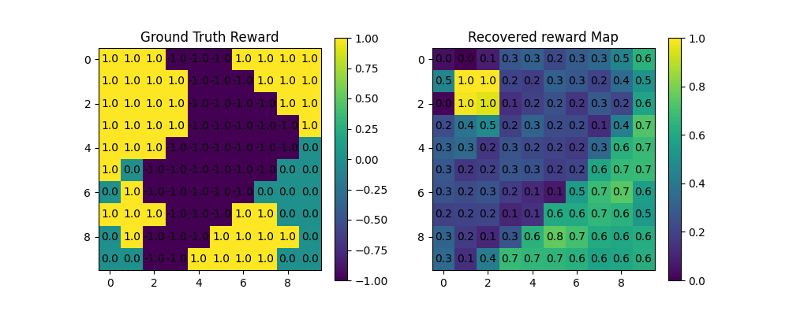
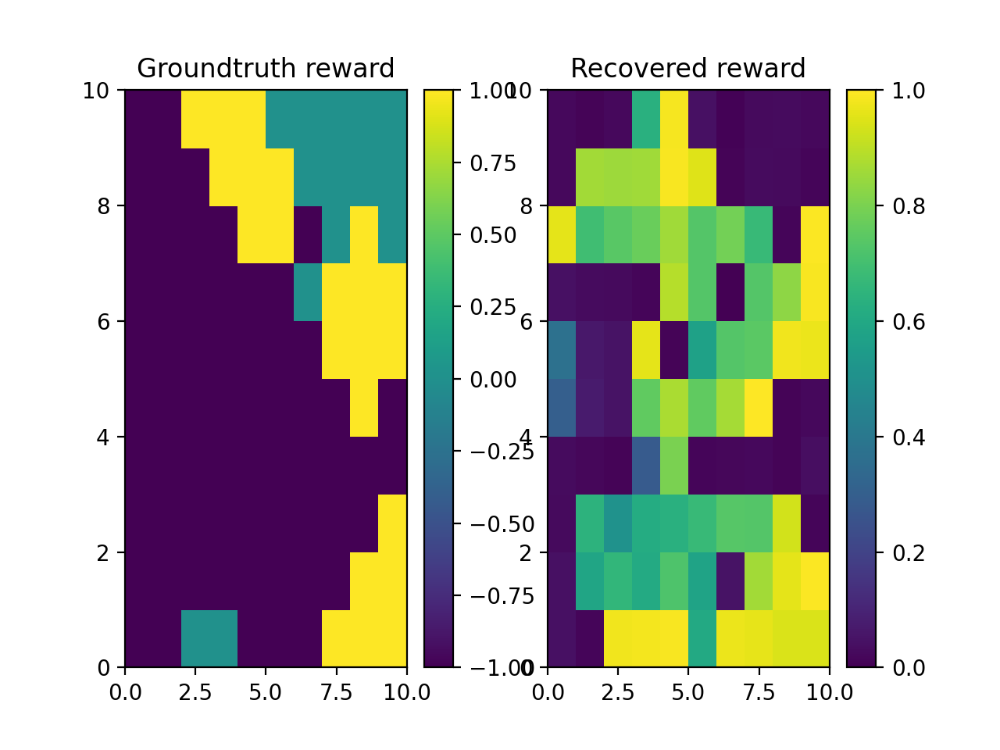
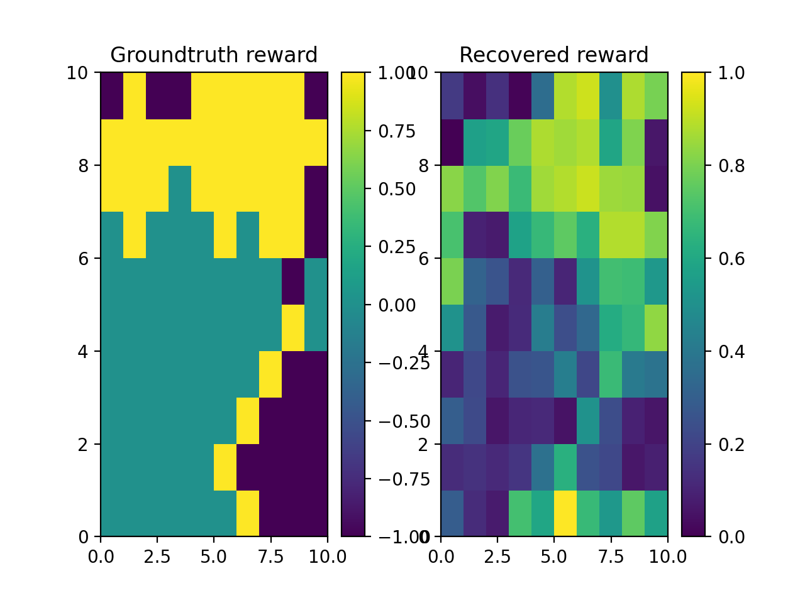

# irl-for-self-learning
A repository for inverse reinforcement learning methods and applications, for projects where agents learn from themselves or other agents within an environment.

Implementations by B.I. Lyons and Jerry Zhao in Python3.


## Results

GridWorld(5*5)

* **Standard Maxent IRL**
  
  

* **Deep Maxent IRL (Pytorch)**

    With 100 iterations.

  


<!-- * **Deep Maxent IRL on ObjectWorld**
  
    With 100 iterations.

  
 -->


* **Deep Maxent IRL on ObjectWorld**
  
    Trail 1 : With 100 iterations. (Loss is 0.12, coverge quite fast)

  

    Trail 2:
  
  
  
		Trail 3: Best result so far with more trajectory samples and length:
    After 200 episodes, with the following config: loss becomes 3.17.
    
    Configs:

    ```
    grid_size = 10           ; wind = 0.3
  trajectory_length = 25   ; discount = 0.95
    n_objects = 15           ; n_colours = 2
    n_trajectories = 200     ; learning_rate = 0.001
    epochs = 200             ; **Adam optimiser**
    ```
  
  


    Trail 4

  

    Trail 5:
  
  
  