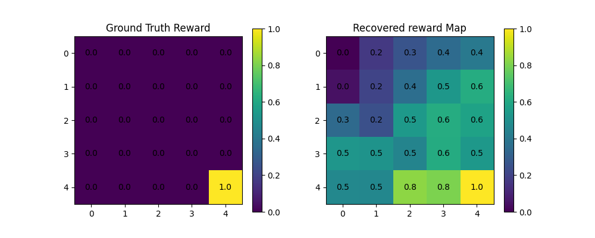
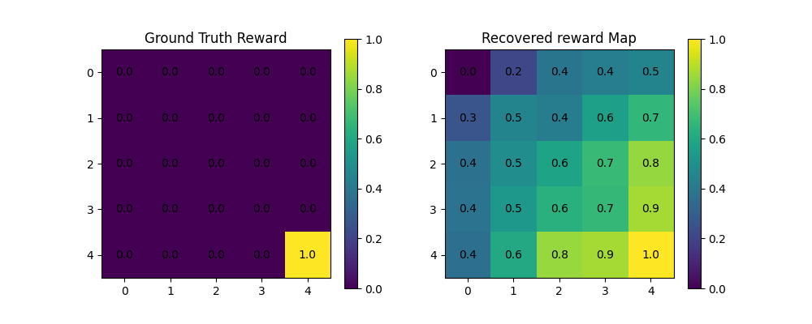
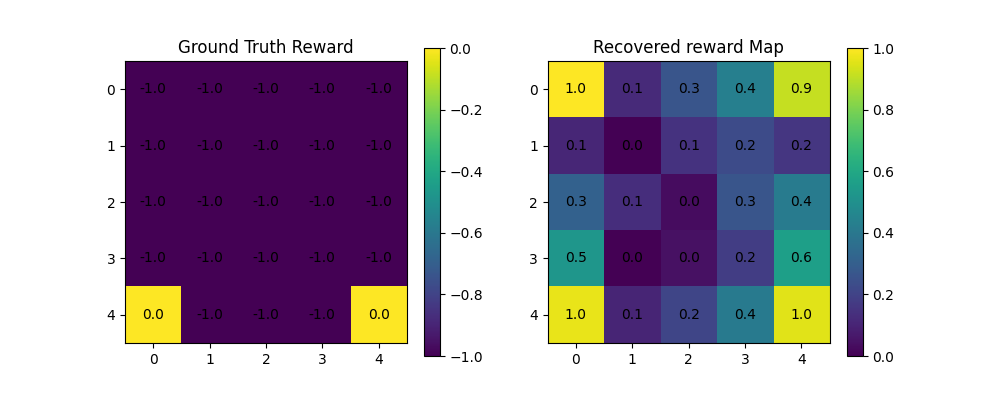

# irl-for-self-learning
A repository for inverse reinforcement learning methods and applications, for projects where agents learn from themselves or other agents within an environment.

Implementations by B.I. Lyons and Jerry Zhao in Python3.

## Results

GridWorld(5*5)

* **Standard Maxent IRL**
  
  

* **Deep Maxent IRL (Pytorch)**

    With 100 iterations.

  

* **Deep Maxent IRL on ObjectWorld**
  
    With 100 iterations.

  